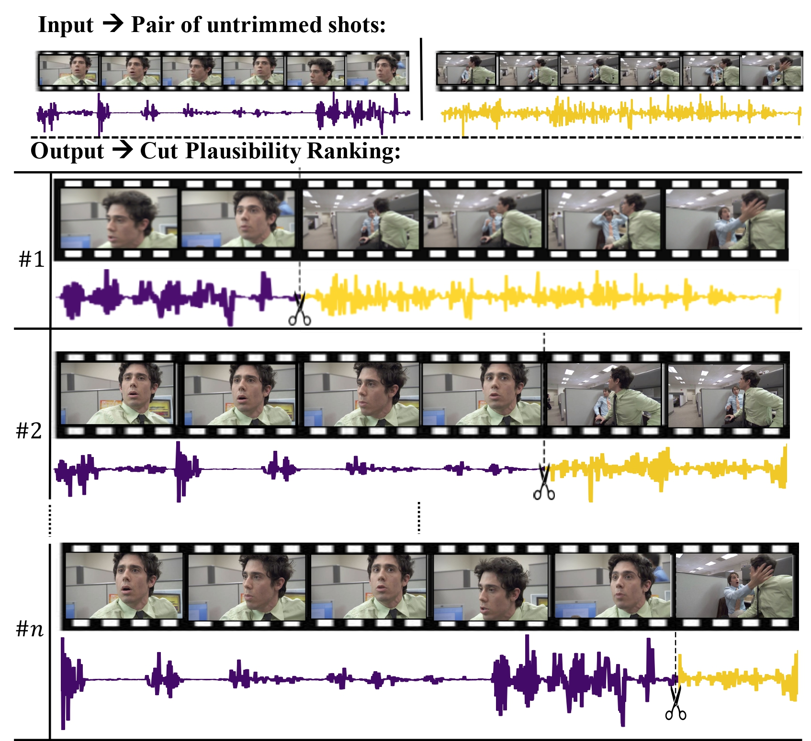

# Learning to Cut by Watching Movies 
Official Code of ICCV 2021 Paper: [Learning to Cut by Watching Movies](https://arxiv.org/abs/2108.04294)

**Learning to Cut by Watching Movies.**
Alejandro Pardo*, Fabian Caba Heilbron, Juan León Alcázar, Ali Thabet, Bernard Ghanem. In *ICCV*, 2021.




# Installation

Clone the repository and move to folder:
```bash
git clone https://github.com/PardoAlejo/LearningToCut.git
cd LearningToCut
```

Install environmnet:
```bash
conda env create -f ltc-env.yml
```

# Data
Download the following resources and extract the content in the appropriate destination folder. See table. 

| **Resource** | Video | Audio | Destination Folder |
| ----         |:-----:         |:-----:    |  :-----:    |
| **Features** |  [link](https://drive.google.com/file/d/1hp5T0LCQYXu5aCxLrsU3IqGxgL3rJ9xM/view?usp=sharing) | [link](https://drive.google.com/file/d/1EDMaGM_s2g8aHchlb4pyxg7pe7kERss-/view?usp=sharing) | `./data/`|

| **Resource** | Train | Val | Destination Folder |
| ----         |:-----:         |:-----:    |  :-----:    |
| **Annotations** |  [link](https://drive.google.com/file/d/11i0ac9fydn6scBuh7O-Sdb_3yzq5DSiK/view?usp=sharing) | [link](https://drive.google.com/file/d/1Qs8NwFz2_0jaLVphUAPZrnhaP0W0T5JU/view?usp=sharing) | `./data/`|

| **Resource** | Durations | Destination Folder |
| ----         |:-----:    |  :-----:    |
| **Video Durations** |  [link](https://drive.google.com/file/d/1OsmJiLeMAyAjl97Jsf7jApRDxTk_AhxS/view?usp=sharing) | `./data/`|

| **Resource** | Checkpoints | Destination Folder |
| ----         |:-----:         |  :-----:    |
| **Best Model** |  [link](https://drive.google.com/file/d/12Ci0bEYb9jjU7l_EpsL_Fgel7zWCy_ML/view?usp=sharing) | `./checkpoints/`|

The folder structure should be as follows:
```
README.md
ltc-env.yml
│
├── data
│   ├── ResNexT-101_3D_video_features.h5
│   ├── ResNet-18_audio_features.h5
│   ├── subset_moviescenes_shotcuts_train.csv
│   ├── subset_moviescenes_shotcuts_val.csv
│   └── durations.csv
│
├── checkpoints
|    ├── best_state.ckpt
│
└── scripts
```

# Inference

Copy paste the following commands in the terminal. </br>


Load environment: 
```bash
conda activate ltc
cd scripts/
```


Inference on val set 
```bash
sh inference.sh
```
# Expected results (Table 1 of the Paper):
| Method | AR1-D1 | AR3-D1 | AR5-D1 | AR10-D1 | AR1-D2 | AR3-D2 | AR5-D2 | AR10-D2 | AR1-D3 | AR3-D3 | AR5-D3 | AR10-D3 |
|--------|--------|--------|--------|---------|--------|--------|--------|---------|--------|--------|--------|---------|
| Random | 0.64%  | 1.91%  | 3.15%  | 6.28%   | 1.85%  | 5.65%  | 9.32%  | 18.52%  | 3.67%  | 10.67% | 17.62% | 33.91%  |
| Raw    | 1.16%  | 3.97%  | 6.36%  | 11.72%  | 2.51%  | 8.32%  | 13.15% | 24.25%  | 3.73%  | 12.19% | 19.33% | 34.97%  |
| LTC    | 8.18%  | 17.95% | 24.44% | 30.35%  | 15.30% | 35.11% | 48.26% | 59.42%  | 19.18% | 46.32% | 64.30% | 79.35%  |
</br>

# Cite us
```
@InProceedings{Pardo_2021_ICCV,
    author    = {Pardo, Alejandro and Caba, Fabian and Alcazar, Juan Leon and Thabet, Ali K. and Ghanem, Bernard},
    title     = {Learning To Cut by Watching Movies},
    booktitle = {Proceedings of the IEEE/CVF International Conference on Computer Vision (ICCV)},
    month     = {October},
    year      = {2021},
    pages     = {6858-6868}
}
```
